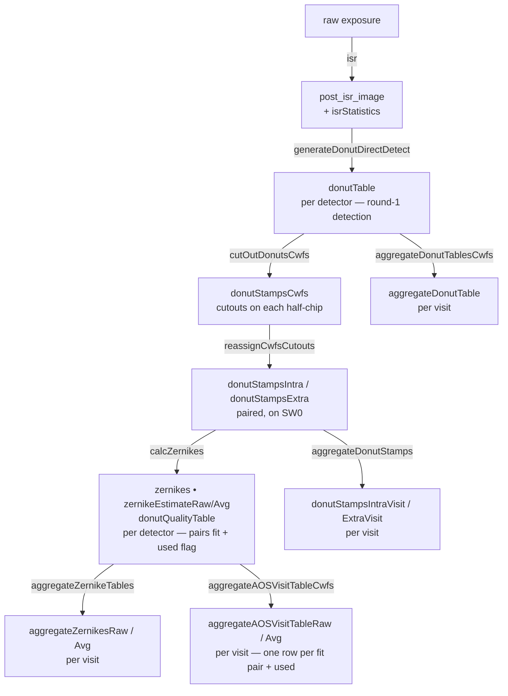

# ts_wep Corner-WFS Data Flow

How the AOS corner-wavefront-sensor (CWFS) pipeline products in collection
`LSSTCam/runs/aos/cwfs/danish_1_0/wep_17_3_0/dv_4_2_0/bin_x2` (repo `/repo/main`)
are produced and how they connect, from raw images to the aggregated Zernike tables.

Verified against the ts_wep / donut_viz task connections and the butler dataset-type
dimensions on 2026-06-13.

---

## Corner-WFS geometry

Each corner raft has two half-sensors that are physically offset in focus:

| Slot | Defocus | Detector ids |
|------|---------|--------------|
| `SWx_SW0` | **extra**-focal | 191 (R00), 195 (R04), 199 (R40), 203 (R44) |
| `SWx_SW1` | **intra**-focal | 192 (R00), 196 (R04), 200 (R40), 204 (R44) |

Donuts are detected independently on each half-chip, then **paired** (one intra +
one extra). All paired products (`donutStampsIntra/Extra`, `zernikes`,
`donutQualityTable`) are written on the **SW0 / extra** detector of each raft; the
SW1 / intra detector only carries its own `donutTable`.

---

## Pipeline flow

---

## Stage-by-stage products

Dimensions are abbreviated: **det** = keyed by `detector` (one per half-chip),
**visit** = one per visit (no detector). Standard `*_config`, `*_log`, `*_metadata`
provenance datasets exist for every task and are omitted below.

### 1. ISR — `isr`

| Dataset type | Key | Storage class | Notes |
|---|---|---|---|
| `post_isr_image` | det | `Exposure` | ISR-corrected image, in **electrons** (gains applied; flat applied, dome; bias/dark not subtracted — overscan only). No `preliminary_visit_image` is produced for CWFS. |
| `isrStatistics` | det | `StructuredDataDict` | Per-amp ISR statistics. |

### 2. Donut detection — `generateDonutDirectDetect`

**in:** `post_isr_image`, `camera` → **out:** `donutTable`

| Dataset type | Key | Storage class | Notes |
|---|---|---|---|
| `donutTable` | det | `AstropyQTable` | **Round-1 selected** donuts (direct detection). Columns: `coord_ra`, `coord_dec`, `centroid_x`, `centroid_y`, `detector`, `source_flux`, `donut_id`. `donut_id` = `{visit}_{detector}_{NNN}`. |

### 3. Cut out donuts — `cutOutDonutsCwfs`

**in:** `post_isr_image`, `donutTable`, `camera` → **out:** donut stamps

| Dataset type | Key | Storage class | Notes |
|---|---|---|---|
| `donutStampsCwfs` | det | `StampsBase` | Postage-stamp cutouts of the detected donuts on each half-chip. |

### 4. Reassign pairs — `reassignCwfsCutouts`

**in:** `donutStampsCwfs` (`donutStampsIn`) → **out:** `donutStampsIntra`, `donutStampsExtra`

| Dataset type | Key | Storage class | Notes |
|---|---|---|---|
| `donutStampsExtra` | det (SW0) | `StampsBase` | Extra-focal stamps, paired. |
| `donutStampsIntra` | det (SW0) | `StampsBase` | Intra-focal stamps (sourced from SW1), reassigned onto the SW0 detector so each intra/extra pair is co-located. |

### 5. Estimate Zernikes — `calcZernikes`

**in:** `donutStampsExtra`, `donutStampsIntra`, `intrinsicTables` → **out:** the fit
products below (all on the SW0 detector).

| Dataset type | Key | Storage class | Notes |
|---|---|---|---|
| `donutQualityTable` | det (SW0) | `AstropyQTable` | Quality metrics per donut (both intra & extra). Columns include `SN`, `ENTROPY`, `FRAC_BAD_PIX`, `MAX_POWER_GRAD`, their per-criterion `*_SELECT` flags, `RADIUS`, `DEFOCAL_TYPE` (`intra`/`extra`), `DONUT_ID`, and the combined **`FINAL_SELECT`**. |
| `zernikes` | det (SW0) | `AstropyQTable` | One `average` row + one row per **fit pair** (`pair1…pairN`), with a **`used`** flag, `intra_donut_id`/`extra_donut_id`, field positions, and `Z4…Z28` coefficients. |
| `zernikeEstimateRaw` | det (SW0) | `NumpyArray` | Per-pair Zernike coefficients (array form). |
| `zernikeEstimateAvg` | det (SW0) | `NumpyArray` | Averaged Zernike coefficients (array form). |

### 6. Aggregation (per visit) — donut_viz tasks

These concatenate the per-detector products of a visit into per-visit tables.

| Task | Dataset type(s) | Key | Storage class | Notes |
|---|---|---|---|---|
| `aggregateDonutTablesCwfs` | `aggregateDonutTable` | visit | `AstropyQTable` | All donuts carried into fitting, with field angles (`thx/thy_OCS/CCS`, `th_N/W`), `snr`, `focusZ`. (Extra side capped per detector, so this is a subset of all detections.) |
| `aggregateZernikeTables` | `aggregateZernikesRaw`, `aggregateZernikesAvg` | visit | `AstropyTable` | Per-visit Zernike tables (raw per-pair, and averaged). |
| `aggregateAOSVisitTableCwfs` | `aggregateAOSVisitTableRaw`, `aggregateAOSVisitTableAvg` | visit | `AstropyTable` | **Primary working table.** `…Raw` has one row **per fit donut pair** across the SW0 detectors, with **`used`**, `detector`, `donut_id_intra`/`donut_id_extra`, per-member centroids/SNR/field angles, and `zk_*` Zernikes (CCS/OCS/NW frames, plus `_intrinsic` and `_deviation`). `…Avg` is the per-detector averaged estimate. |
| `aggregateDonutStamps` | `donutStampsIntraVisit`, `donutStampsExtraVisit` | visit | `StampsBase` | Per-visit concatenation of the paired stamps. |

---

## Donut selection stages (join key = `donut_id`)

| Stage | Definition | Source |
|-------|-----------|--------|
| **selected** | detected in round 1 | row in `donutTable` |
| *(quality-selected)* | passed quality cuts | `donutQualityTable.FINAL_SELECT == True` |
| **fit** | member of a fit pair | `donut_id` ∈ `aggregateAOSVisitTableRaw.donut_id_intra ∪ donut_id_extra` |
| **used** | member of a *used* pair | same, restricted to rows with `used == True` |

Pairs are 1:1 (each intra donut pairs with one extra), so the number of fit donuts =
2 × (number of pairs) and used donuts = 2 × (number of `used` pairs). The intra side
is usually the limiting factor (fewer detections), so `n_fit ≈ n_intra_detected`.

Example — visit `2026032700118`: 151 detected → 124 in `aggregateDonutTable` →
44 pairs fit (88 donuts) → 37 pairs used (74 donuts).

---

## Notes & caveats

- **Units:** `post_isr_image` pixels are in **electrons** (gains applied).
- **Flat fielding:** applied (`LSST ISR FLAT APPLIED = True`, dome flat). Header carries
  `ISR FLAT SEQUENCER MISMATCH = True` — the flat was built with a different sequencer
  config than the on-sky CWFS data, so its accuracy may be imperfect.
- **No PVI:** the CWFS pipeline does not make `preliminary_visit_image`; that is a
  full-focal-plane / FAM product.
- Connection in/out names for the ts_wep tasks (isr, generateDonutDirectDetect,
  cutOutDonutsCwfs, reassignCwfsCutouts, calcZernikes) were read directly from the task
  `Connections` classes. The donut_viz aggregation task names come from the `*_config`
  datasets present in the collection; their outputs are pinned by the per-visit dataset
  types listed above.
